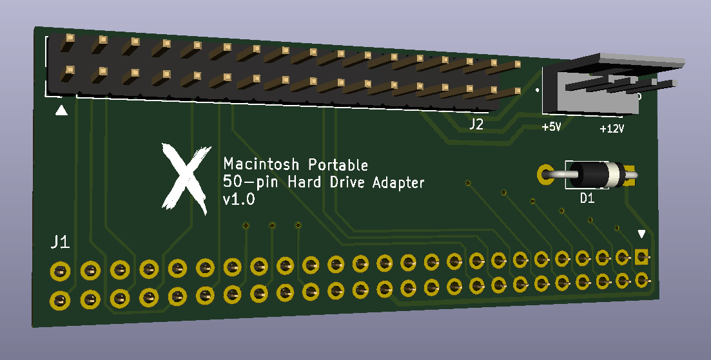

# Macintosh Portable 50-pin Hard Drive Adapter v1.0

An adapter to allow you to use any standard 50-pin SCSI device as the Macintosh Portable hard drive.

**Special thanks to all the people on the Open Retro SCSI Discord server for their insight and help.**

